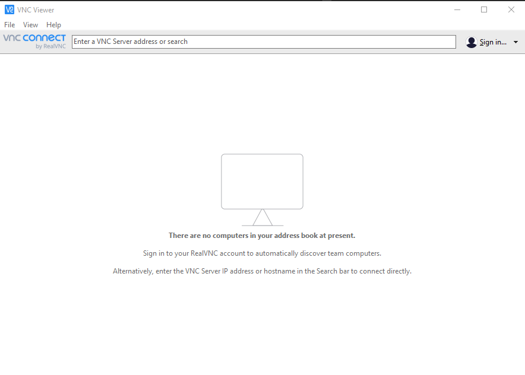
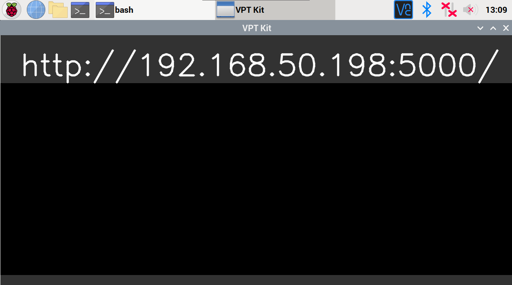

# Updating the Raspberry Capture Kit
The purpose of this file is to walk one through on updating the Raspberry Pi Capture Kit to the most up to date version.

# VNC Viewer
The Raspberry Pi Capture Kits come with VNC installed on them, which is a way to control the computer from a connected device. There download link for VNC can be found [here](https://www.realvnc.com/en/connect/download/viewer/)


VNC Viewer window

Near the top there is the a bar with the words "Enter a VNC Server address or search." This is where the raspberry pi's address will need to be put in. The address should be shown on the Raspberry Pi's screen if it is already connected to the internet. Enter everything between the "http://" and ":5000" shown below.


Opencv window showing the local ip

In this case the vnc server address would be 192.168.50.198, but this may not be the same for everyone

# Terminal
Now that VNC Viewer has connected to the Raspbeery Pi it is time to update. In order to update, open the terminal by clicking the `>_` icon near the top left of the screen. Then enter the following commands  in the terminal window.

```
$ cd Documents/
$ cd raspberry-capture-kit/
$ git pull
```
If ```git pull``` fails due to files being modified or any reason it is possible to undo those modifications to allow ```git pull``` to work. In order to do this type:
```
$ git reset --hard HEAD
$ git pull
```
Then ```git pull``` should be able to get the latest version of the files.

To verify or check that the software is up to date. One can type ```git status``` and it will say if the software is the most up to date version. 

```
$ git status
On branch release
Your branch is up to date with 'origin/release'.

nothing to commit, working tree clean
```
